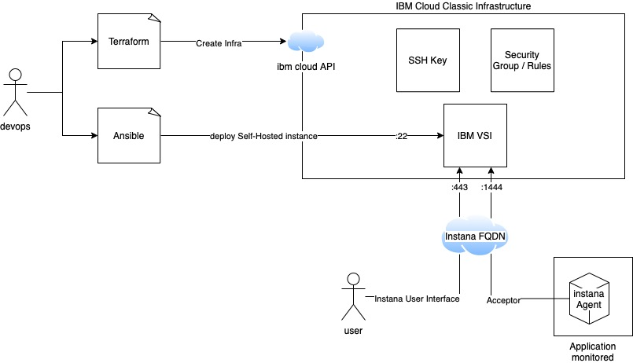
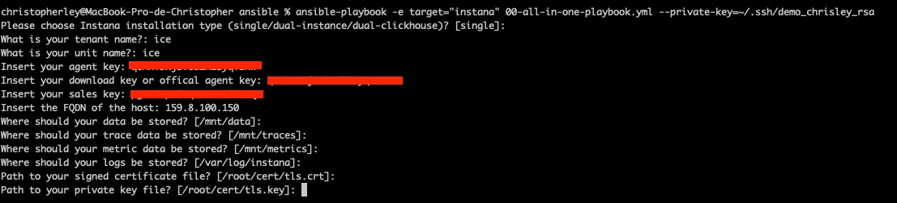
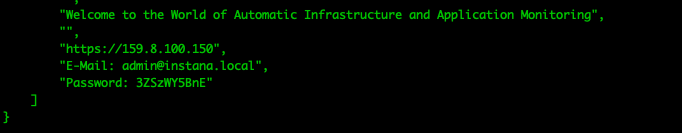
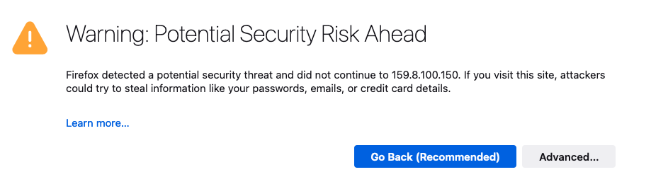
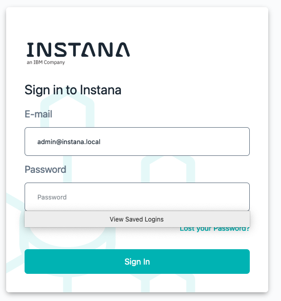
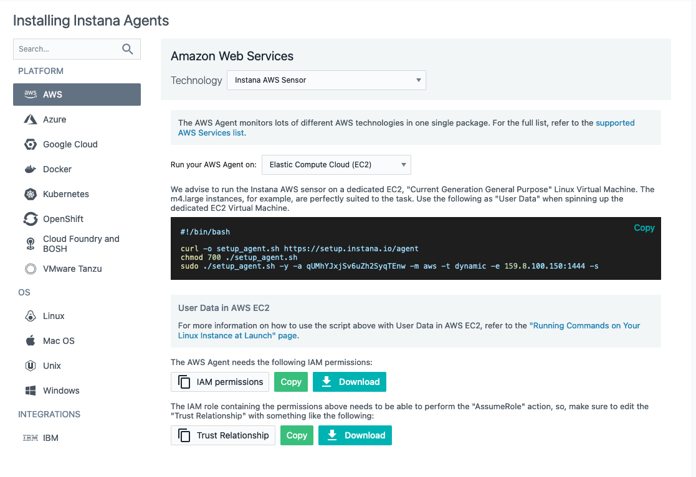
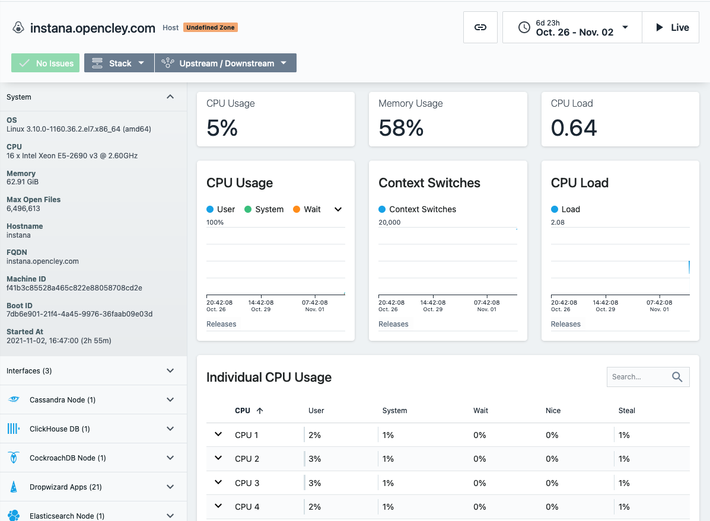

# Deploying instana self-hosted instance on IBM Cloud

### Prerequisites

- [Terraform > 0.12](https://www.terraform.io/downloads.html) 
- [Ansible](https://docs.ansible.com/ansible/latest/installation_guide/intro_installation.html#installing-ansible-on-specific-operating-systems)
- Instana Sales Key - [Here for IBMers](https://ibm.seismic.com/app?ContentId=11afffe3-faf5-4b39-948c-1b8b4e7bc057#/doccenter/f6bc8873-d580-4ee8-a903-c4e0d3a7eee9/doc/%252Fdd85c941b1-5f54-2314-ce72-b98c4c0974c2%252FdfOTRiYmU4NTQtNWY4NC03Y2QyLWZjYWUtOGIxYmFmZjkyZThk%252CPT0%253D%252CU2VsbGVyIGVuYWJsZW1lbnQ%253D%252Flf9191f128-7cbd-4d31-ae38-a43ffbc78605/grid/)
- Instana Agent Key - [Here for IBMers](https://ibm.seismic.com/app?ContentId=11afffe3-faf5-4b39-948c-1b8b4e7bc057#/doccenter/f6bc8873-d580-4ee8-a903-c4e0d3a7eee9/doc/%252Fdd85c941b1-5f54-2314-ce72-b98c4c0974c2%252FdfOTRiYmU4NTQtNWY4NC03Y2QyLWZjYWUtOGIxYmFmZjkyZThk%252CPT0%253D%252CU2VsbGVyIGVuYWJsZW1lbnQ%253D%252Flf9191f128-7cbd-4d31-ae38-a43ffbc78605/grid/)

### HLD





### Create IBM Cloud infrastructure with Terraform (Classic Infrastructure)

1. Clone repository

2. Go to [terraform/ibm](terraform/ibm)

   ```shell
   $ cd terraform/ibm
   ```

   

3. Export IBM Cloud Variables or create tfvars files

   <u>TF Vars</u>

   ```shell
   $ export IC_API_KEY="ibmcloud_api_key"
   $ export IAAS_CLASSIC_USERNAME="iaas_classic_username"
   $ export IAAS_CLASSIC_API_KEY="iaas_classic_api_key"
   ```

   OR

   <u>Ibmcloud.tfvars</u> 

   ```terraform
   IBMCLOUD_API_KEY="ibmcloud_api_key"
   IaaS_CLASSIC_USERNAME="iaas_classic_username"
   IaaS_CLASSIC_API_KEY="iaas_classic_api_key"
   ```

   > Examples deployment with tfvars file is :
   >
   > $ terraform init -var-file="ibmcloud.tfvars"

4. Edit [02_sshkey.tf](terraform/ibm/02_sshkey.tf) file to add your **Public Key**

   ```terraform
   # Create an IBM Cloud infrastructure SSH key. You can find the SSH key surfaces in the infrastructure console under Devices > Manage > SSH Keys
   
   resource "ibm_compute_ssh_key" "instana_key" {
     label      = "instana_key"
     public_key = "<SSH Public Key>"
   }
   ```

   > <u>Example SSH Public Key:</u>
   >
   > "ssh-rsa AAAAB3NzaC1yc2EAAAADAQABAAACAQDvKS/5y2MKKWzcDnpcGQL2SMe7D2N/+zBU8vIRVYV46jocU2MLLqQgNZGat+uASUC+HUPLyopgCdBCkXErLpF7Bk6RJPjFhLPxuc0+LKGQAd3d5FpCivlNEwJkExpw555xM/wvKRq/rNUT+RYXg8xDDnzhjzWUhUIPX5lD00pqHsDfOg2+i8UuCN2xW81b7LfTdtL/kc6J2iv5sxEijbdnUVsWHO6/jogv0w12bAB5GgHNdBFMlkoBkBvbirWfcVElG+oFr/ObnddhRvNTgD0ozAeQkU6g05BjQzgrBUpwb4jy5ar8eku17oZZFvq41693KRQEl7vakEJal4TokEyev62yCLfT4OuhOMp4axzv15DplnHOjGJlGvDeM5cOTz3gQgis8OJqCklCN6es1u/e7Oxd2NoqEic9HxUhn+NdvOz1iSqovDvZxyBdSKFthLa8TwMn0fDbVTkmtTqCPilt1msfx7RneChNAi85s60Dfy0W3wTIwnUQ181CUGBPLJC0gbp6rQKaknhEEEVoIsRWCztwFhD+rLOQAqU4wDmufA5MMEbj5qs04Ij2/pi8kVRjz9sAAlJWtYk9MApbFc4vuJn4AuNkjdomKHuXA0p8xkRGwc7S7MCtjl/EDYEiHmimPb8EWuv6Yve4yRp5MlAbnLf9czuEVQUsvtwMtjxkIw== ley@MacBook-Pro-de-LEY.home"

   

5. Edit VM properties

   ```terraform
   resource "ibm_compute_vm_instance" "instana" {
     hostname            = "instana"
     domain              = "opencley.com"
     ssh_key_ids         = [ibm_compute_ssh_key.instana_key.id]
   
     ## Récuperation de l'image ID dans l'URL de l'image quand on clique dessus depuis le portail IBM Devices > Manage > Images
   
     ## To retrieve the image template ID from the IBM Cloud infrastructure customer portal, navigate to Devices > Manage > Images, click the image that you want, and note the ID number in the resulting URL.
   
     ## https://cloud.ibm.com/gen1/infrastructure/image-templates/$(image_id)/details#main
   
     #image_id           = "1354507"
     os_reference_code   = "CENTOS_7_64"
     datacenter          = "par01"
     network_speed       = 100
     cores               = 16
     memory              = 65536
     #local_disk          = false
     #disks               = [150]
     tags                = [
       "instana",
       "ibmcloud",
       "self-hosted"
     ]
     public_security_group_ids = [ibm_security_group.instana_sg.id]
   }
   ```

   Edit **hostname, domain, datacenter** if you want.

6. Init Terraform

   `terraform init` command is used to initialize a working directory containing Terraform configuration files. This is the first command that should be run after writing a new Terraform configuration or cloning an existing one from version control. It is safe to run this command multiple times.

   ```shell
   $ terraform init
   
   Initializing the backend...
   
   Initializing provider plugins...
   
   - Finding ibm-cloud/ibm versions matching "~> 1.12.0"...
   - Installing ibm-cloud/ibm v1.12.0...
   - Installed ibm-cloud/ibm v1.12.0 (self-signed, key ID AAD3B791C49CC253)
   
   ...
   
   Terraform has been successfully initialized!
   ```

   

7. Plan deployment

   `terraform plan` command creates an execution plan. By default, creating a plan consists of:

   - Reading the current state of any already-existing remote objects to make sure that the Terraform state is up-to-date.
   - Comparing the current configuration to the prior state and noting any differences.
   - Proposing a set of change actions that should, if applied, make the remote objects match the configuration.

   ```shell
   % terraform plan
   
   Terraform used the selected providers to generate the following execution plan. Resource actions are indicated with the following symbols:
   
     + create
   
   Terraform will perform the following actions:
   
   ...
   # ibm_compute_ssh_key.instana_demo_sshkey will be created
   ...
   # ibm_compute_vm_instance.instana will be created
   ...
   # ibm_security_group.instana_demo_sg will be created
   ...
   # ibm_security_group_rule.instana_demo_egress_all will be created
   ...
   # ibm_security_group_rule.instana_demo_ssh will be created
   ...
   # ibm_security_group_rule.instana_demo_80 will be created
   ...
   # ibm_security_group_rule.instana_demo_443 will be created
   ...
   # ibm_security_group_rule.instana_demo_86 will be created
   ...
   # ibm_security_group_rule.instana_demo_446 will be created
   ...
   # ibm_security_group_rule.instana_demo_1444 will be created
   ...
   
   Plan: 10 to add, 0 to change, 0 to destroy.
   ```

   10 resources types will be created:

   - Ssh key to connect to the vsi
   - Virtual Server Instance (vsi) - Minimal VM Size: **16 CPU / 64 GB** for Instana Self-Hosted
   - Security Group
   - Security Rules to allow **SSH** Ingress
   - Security Rules to allow port **80** Ingress
   - Security Rules to allow port **443** Ingress
   - Security Rules to allow port **86** Ingress
   - Security Rules to allow port **446** Ingress
   - Security Rules to allow port **1444** Ingress
   - Security Rules to allow all **Egress** 

   

   > Security Rules for Instana:
   >
   > - Port 80: Used to catch broken links and promote them to SSL
   > - Port 443: Primary application port for UI and API
   > - Port 86 and 446: EUM ports, please check the more detailed docs [here](https://www.instana.com/docs/self_hosted_instana/end-user-monitoring/#exposing-the-monitoring-endpoint-to-end-users)
   > - Port 1444: Acceptor port for agents to connect to

   

8. Apply deployment to create IBM Cloud resources

   `terraform apply` command executes the actions proposed in a Terraform plan.

   The infrastructure will be created.

   

   ```shell
   % terraform apply 
   
   Terraform used the selected providers to generate the following execution plan. Resource actions are indicated with the following symbols:
   
     + create
   ...
   ...
   Apply complete! Resources: 10 added, 0 changed, 0 destroyed.
   
   Outputs:
   
   ip_address = "<EXTERNAL IP OF INSTANA INSTANCE>"
   ```

   **Use the output generated "ip_address" as FQDN of instance self-hosted instance.**

   **This IP will be used for ansible Playbook and Instana FQDN .**

   

### Deploy Instana application with Ansible

1) Go to [ansible](ansible)

   ```shell
   $ cd ansible 
   ```

   

2) Edit [host](ansible/hosts) inventory with External "ip_address" from output Terraform (step 6 - Terraform apply)

   ```shell
   [instana]
   <FQDN - External ip_address>
   ```

   

3) Run Ansible playbook [00-all-in-one-playbook.yml](ansible/00-all-in-one-playbook.yml) 

   This ansible playbook is interactive to fill in the informations needed to deploy an instana Self-hosted instance.

   Some parameters have default values that can be used or overridden.

   **Others must be filled in and are mandatory.**
   Here are the mandatory parameters to fill in:

   - **tenant name**
   - **unit name**
   - **AgentKey**
   - **DownloadKey (Same as AgentKey)**
   - **Sales Key**
   - **FQDN (External IP from Terraform Output)**

   ```shell
   % ansible-playbook -e target="instana" 00-all-in-one-playbook.yml --private-key=<YOUR_SSH_KEY>
   ```

   

   

4) Output of Ansible

   At the end of the deployment, informations connection will be printed in the ansible playbook output.

   (Credentials are dynamically generated)

   

   > Credentials are dynamically generated

5) Connect to instana

   Go to https://<FQDN>

   (Accepted the risk due to self-generated certificate)

   

   Login with the credentials displayed in the output of the ansible installation (previous step)

   

   

   You can now install and deploy agent to several infra and app to monitor events

   

   ```shell
   # curl -o setup_agent.sh https://setup.instana.io/agent && chmod 700 ./setup_agent.sh && sudo ./setup_agent.sh -a qUMhYJxjSv6uZh2SyqTEnw -t dynamic -e 159.8.100.150:1444 -m infra
   
     % Total    % Received % Xferd  Average Speed   Time    Time     Time  Current
                                    Dload  Upload   Total   Spent    Left  Speed
   100 20470  100 20470    0     0   3554      0  0:00:05  0:00:05 --:--:--  4819
   Setting up the dynamic Instana agent for GNU/Linux
   Are you sure? [y/N] y
   Setting up Instana RPM repository
   Updating YUM metadata
   Installing Instana agent
   ```

   <u>Start Agent</u>

   ```
   # systemctl status instana-agent.service
   
   # systemctl start instana-agent.service
   
   # systemctl enable instana-agent.service
   ```

   

   

### Delete SandBox

Use Terraform to delete all the installation and minimize the infrastructure footprint.

#### Delete deployment

```shell
% terraform destroy 
ibm_compute_ssh_key.instana_key: Refreshing state... [id=2097588]
ibm_security_group.instana_sg: Refreshing state... [id=3664942]
ibm_security_group_rule.instana_allow_ssh: Refreshing state... [id=9733394]
ibm_security_group_rule.instana_allow_1444: Refreshing state... [id=9732888]
ibm_security_group_rule.instana_allow_egress_all: Refreshing state... [id=9733252]
ibm_security_group_rule.instana_allow_80: Refreshing state... [id=9733536]
ibm_security_group_rule.instana_allow_86: Refreshing state... [id=9733596]
ibm_security_group_rule.instana_allow_443: Refreshing state... [id=9733536]
ibm_security_group_rule.instana_allow_446: Refreshing state... [id=9733600]
ibm_compute_vm_instance.instana: Refreshing state... [id=125456042]

...

Destroy complete! Resources: 10 destroyed.
```

